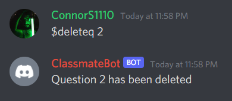
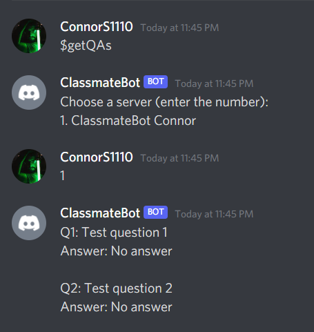
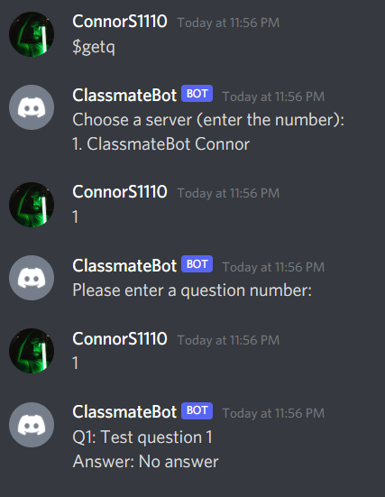
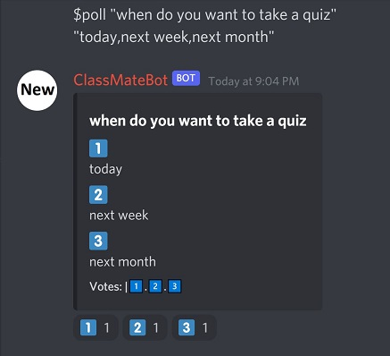

[Project 3 Delta Video](https://youtu.be/EpLe_EBi5BI)

<h1 align="center" >ClassMate Bot</h1>

  <a href="#dart-basic-overview">Basic Overview</a>
  ::
  <a href="#orange_book-description">Description</a>
  ::
  <a href="#arrow_down-installation">Installation</a>
  ::
  <a href="#computer-commands">Commands</a>
  ::
  <a href="#earth_americas-future-scope">Future Scope</a>
  ::
  <a href="#pencil2-contributors-for-project-2">Contributors</a>

---

https://user-images.githubusercontent.com/89809302/140442405-e043564d-c946-4116-bb79-e9f8a341da21.mp4

<a href="https://youtu.be/U59HyX21S7k">Watch on YouTube</a>

---

## :dart: Basic Overview

This project helps to improve the life of students, TAs and teachers by automating many mundane tasks which are sometimes done manually. ClassMateBot is a discord bot made in Python and could be used for any discord channel.

This is Project 2 for the ClassMate Bot. Changes are marked below and listed in [Project 2 Changes](https://github.com/lyonva/ClassMateBot/blob/main/docs/Project2Changes.md).

---

## :orange_book: Description

There are three basic user groups in a ClassMateBot, which are Students, Professor and TAs. Some basic tasks for the bot for the students user group should be automating the task of group making for projects or homeworks, Projection deadline reminders, asking questions, getting questions for review etc. For TAs it is taking up polls, or answering questions asked by the students.

Our ClassMateBot focuses on the student side of the discord channel, i.e. currently it focuses on the problems faced by the students while using these discord channels.

The user stories covered here would be more concerned about the activities for the channel for Software Engineering class in North Carolina State University for the Fall 2021 semester.

---

### 1 - Student Verification
Once the new member joins the server, before giving them the access to the channels there is a need to get the real full name of the member to map it with the discord nick name. This mapping can later be used for group creation, voting and so on. To do this we first assign the unverified role to the new comer and then ask them to verify their identity using $verify command. If that goes through, the member is assigned a student role and has full access to the server resources. The bot then welcomes the member and also provides important links related to the course.

### 2 - Project Voting **(Reworked on Project 3)**
Voting for projects is a common occurence that many students must endure. With the addition of a voting system, this task is made easier by allowing student groups to vote thier favourites projects with the use of discord system. With the combination of the ClassMateBot grouping system, teams can easily vote their group into a project, switch their votes, or view the full list of projects that have been voted for.

#### 2a - Set Vote Limit **(New Project 3 Commands)**
The instructor has the option to set the limit for the number of votes that a particular project can receive. In order for instructor to promote multiple project selection, the setlimit option can be used which will enforce that a single project can only receive n number of votes and a group might have to opt for a different project if the selected project has already received n votes.

### 3 - Deadline Reminder **(Reworked on Project 3)**
The next important thing our project covers is the Deadline reminder feature of our bot. Students and instructors may add homeworks, links, and due dates using the system, and then view their daily or weekly dues with ease. Even better, if you are an instructor, you can easily add reminders for all your students. No longer will a student be vulnerable to those odd submission times like 3:00 PM. See all homeworks you have due across all classes, as well as your homeworks due today or due this week!

### 4 - Personally Pinning Messages
Another problem that the students face is that they cannot pin important messages they want to go back to later. With pinned messages, the student can save discord message links easily to point back to prior messages or just leave their own general messages. It is a very easy system to use. You can copy the link of the message you want to pin and <b>DM the bot</b> to pin it. In case the bot is present in multiple servers, it will ask you which server you want to pin the message to.

### 5 - Group Creation
Another unique and useful feature of our ClassMateBot is that it helps the students in the process of group making for their projects. Through this feature, the bot could help the students identify other members of the class with similar ideals and acts as a medium to connect them initially. This feature is also helpful for students randomly assigned to a group to connect with the new member which would not only save time, but also, saves effort as many times students do not have their names as their usernames on discord. Through this students can join, leave or connect with others.

Moreover, the group creation feature allows members of the group to join a private text channel to communicate with ease! This works by assigning a role to the user when they join a group and giving them access to the private channel specically for their group, this is especially useful when switching groups because a change in the user's role will automatically revoke access to the private channel. Additionally, the private channels are set up so instructors can help with clarifications directly without having to reach out to them via DMs.

### 6 - Question and Answer **(New Project 2 Commands)**
A common usage for our current class Discord is for students to ask questions about the course. It is helpful for the questions to be numbered and for the answers to be attached to the question so it be easily found. Some students may feel more comfortable asking and answering questions anonymously. It is also helpful for users to know if the question is answered by a student or instructor. This feature keeps the questions and answers all in one channel so it does not clutter other channels and can be more easily viewed.

#### 6a - Delete Question **(New Project 3 Commands)**
There can be many situations where we would want to delete a question. It may be a duplicate of another question, a question that is better handled privately, or some other form of spam. With project 3, instructors now have the ability to delete questions.

#### 6b - Get All Questions & Answers **(New Project 3 Commands)**
A user may want to easily see a list of all the questions and answers that have been asked in a server. To prevent spam in the server itself, the user sends the command to the bot through a direct message, the bot responds asking the user to select a server, and then returns with a nicely formatted list of all the questions and answers that have been asked in the requested server

#### 6c - Get a Question & Answer **(New Project 3 Commands)**
A user may want to easily see a specific question and answer that have been asked in a server. To prevent spam in the server itself, the user sends the command to the bot through a direct message, the bot responds asking the user to select a server and question number, and then returns with a nicely formatted presentation of the question and answer that has been asked in the requested server

### 7 - Review Questions **(New Project 2 Commands)**
An essential part of studying is going over questions related to the exam topics. This feature allows instructors to add review questions and students to get random review questions. To enhance its effectiveness, the answers to the review questions are hidden as a *spoiler* that students can choose to unveil when they are ready.

### 8 - poll command (New Project 3 Command)

An instructor may want to send a poll to the students. This can be done by using $poll command. The poll will be posted as a reaction poll where every option in the poll is represented by a number in the reactions. To vote, you have to react to the message with the number corresponds to the chosen option.

### 9 Autogroup (New Project 3 Command)

This command automatically splits the existing members in the server into different groups. It is useful for professors for splitting the students into different groups for homework and projects.

### 10 Autojoin (New Project 3 Command)

This command adds each member in a group to their separate group text channel. This will help the students to coordinate with other members of their group for working on their assignments and project. 

---

## :arrow_down: Installation
To install and run the ClassMate Bot, follow instructions in the [Installation Guide](https://github.com/lyonva/ClassMateBot/blob/main/docs/installation.md).

---

## :computer: Commands
For the newComer.py file

:open_file_folder: [$verify command](https://github.com/lyonva/ClassMateBot/blob/main/docs/Verification/verify.md) **(Modified Command in Project 2)**

For the voting.py file **(All Modified Commands in Project 2)**

:open_file_folder: [$projects command](https://github.com/lyonva/ClassMateBot/blob/main/docs/Voting/projects.md)

:open_file_folder: [$vote command](https://github.com/lyonva/ClassMateBot/blob/main/docs/Voting/vote.md)

:open_file_folder: [$setlimit command](https://github.com/lyonva/ClassMateBot/blob/main/docs/Voting/setlimit.md)

For the deadline.py file **(All Commands Reworked in Project 3)**

:open_file_folder: [$reminderadd (ra) command](https://github.com/lyonva/ClassMateBot/blob/main/docs/Reminders/reminderadd.md)

:open_file_folder: [$reminderedit (re) command](https://github.com/lyonva/ClassMateBot/blob/main/docs/Reminders/reminderedit.md)

:open_file_folder: [$reminderdelete (rd) command](https://github.com/lyonva/ClassMateBot/blob/main/docs/Reminders/reminderdelete.md)

:open_file_folder: [$remindersclear command](https://github.com/lyonva/ClassMateBot/blob/main/docs/Reminders/remindersclear.md)

:open_file_folder: [$reminders command](https://github.com/lyonva/ClassMateBot/blob/main/docs/Reminders/reminders.md)

:open_file_folder: [$duetoday command](https://github.com/lyonva/ClassMateBot/blob/main/docs/Reminders/due_today.md)

:open_file_folder: [$duethisweek command](https://github.com/lyonva/ClassMateBot/blob/main/docs/Reminders/due_this_week.md)

For the pinning.py file **(All Modified Commands in Project 2)**

:open_file_folder: [$pin command](https://github.com/lyonva/ClassMateBot/blob/main/docs/PinMessage/pin.md)

:open_file_folder: [$unpin command](https://github.com/lyonva/ClassMateBot/blob/main/docs/PinMessage/unpin.md)

:open_file_folder: [$pinnedmessages command](https://github.com/lyonva/ClassMateBot/blob/main/docs/PinMessage/pinnedmessages.md)

:open_file_folder: [$updatepin command](https://github.com/lyonva/ClassMateBot/blob/main/docs/PinMessage/updatepin.md)

For the groups.py file

:open_file_folder: [$autogroup command](https://github.com/lyonva/ClassMateBot/blob/main/docs/Groups/autogroup.md) **(New Command in Project 3)**

:open_file_folder: [$autojoin command](https://github.com/lyonva/ClassMateBot/blob/main/docs/Groups/autojoin.md) **(New Command in Project 3)**

:open_file_folder: [$startupgroups command](https://github.com/lyonva/ClassMateBot/blob/main/docs/Groups/startupgroups.md) **(New Command in Project 2)**

:open_file_folder: [$reset command](https://github.com/lyonva/ClassMateBot/blob/main/docs/Groups/reset.md) **(New Command in Project 2)**

:open_file_folder: [$connect command](https://github.com/lyonva/ClassMateBot/blob/main/docs/Groups/connect.md) **(New Command in Project 2)**

:open_file_folder: [$groups command](https://github.com/lyonva/ClassMateBot/blob/main/docs/Groups/groups.md) **(Modified Command in Project 2)**

:open_file_folder: [$group command](https://github.com/lyonva/ClassMateBot/blob/main/docs/Groups/group.md) **(New Command in Project 2)**

:open_file_folder: [$join command](https://github.com/lyonva/ClassMateBot/blob/main/docs/Groups/join.md) **(Modified Command in Project 2)**

:open_file_folder: [$leave command](https://github.com/lyonva/ClassMateBot/blob/main/docs/Groups/leave.md) **(Modified Command in Project 2)**

For the qanda.py file **(All New Commands in Project 2)**

:open_file_folder: [$ask command](https://github.com/lyonva/ClassMateBot/blob/main/docs/QandA/ask.md)

:open_file_folder: [$answer command](https://github.com/lyonva/ClassMateBot/blob/main/docs/QandA/answer.md)

For the reviewqs.py file **(All New Commands in Project 2)**

:open_file_folder: [$addQuestion command](https://github.com/lyonva/ClassMateBot/blob/main/docs/ReviewQs/addQuestion.md)

:open_file_folder: [$getQuestion command](https://github.com/lyonva/ClassMateBot/blob/main/docs/ReviewQs/getQuestion.md)

---

## :pencil2: Contributors for Project 3

<table>
  <tr>
      <td align="center">
          <a href="https://github.com/lyonva">
              
               
              
                  <b>Leo</b>
              
          </a>
           
      </td>
      <td align="center">
        <a href="https://github.com/ConnorS1110">
            
             
            
                <b>Connor</b>
            
        </a>
         
      </td>
      <td align="center">
          <a href="https://github.com/ashwith161">
              
               
              
                  <b>Ashwith</b>
              
          </a>
           
      </td>
      <td align="center">
          <a href="https://github.com/Capt-Fluffy-Bug">
              
               
              
                  <b>Rahul</b>
              
          </a>
           
      </td>
      <td align="center">
          <a href="https://github.com/vasuagrawal19">
              
               
              
                  <b>Vasu</b>
              
          </a>
           
      </td>
      <td align="center">
          <a href="https://github.com/Muhammad-Alahmadi">
              
               
              
                  <b>Muhammad</b>
              
          </a>
           
      </td>
  </tr>

</table>

---

## :pencil2: Contributors for Project 2

<table>
  <tr>
    <td align="center"><a href="https://github.com/TanyaChu"> <b>Tanya Chu</b></a></td>
    <td align="center"><a href="https://github.com/SteveJones92"> <b>Steven Jones</b></a></td>
    <td align="center"><a href="https://github.com/shikhanair"> <b>Shikha Nair</b></a></td>
    <td align="center"><a href="https://github.com/alexsnezhko3"> <b>Alex Snezhko</b></a></td>
    <td align="center"><a href="https://github.com/prdhnchtn"> <b>Pradhan Chetan Venkataramaiah</b></a></td>
  </tr>
</table>

---

## :pencil2: Contributors for Project 1

<table>
  <tr>
    <td align="center"><a href="https://github.com/War-Keeper"> <b>Chaitanya Patel</b></a></td>
    <td align="center"><a href="https://github.com/wevanbrown"> <b>Evan Brown</b></a> </td>
    <td align="center"><a href="https://github.com/kunwarvidhan"> <b>Kunwar Vidhan</b></a> </td>
    <td align="center"><a href="https://github.com/sunil1511"> <b>Sunil Upare</b></a> </td>
    <td align="center"><a href="https://github.com/salvisumedh2396"> <b>Sumedh Salvi</b></a> </td>
  </tr>
</table>
