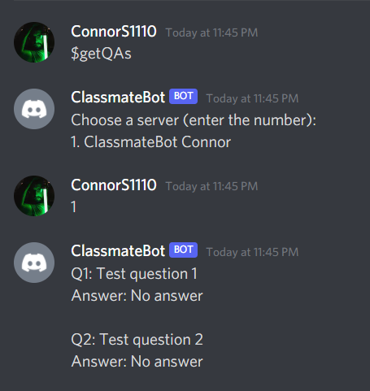

# About $getQAs _(New Project 3 Command)_

Sends DM of all questions and answers

# Location of Code

The code that implements the above mentioned functionality is located in [cogs/qanda.py](https://github.com/lyonva/ClassMateBot/blob/main/cogs/qanda.py).

# Code Description

## Functions

getQAs(self, ctx): <br>
This function takes as arguments the values provided by the constructor through self, context in which the command was called.

# How to run it? (Small Example)

You are in the direct message channel with the bot and enter the command `getQAs` and the bot will show you a list of servers you are in with where the bot is used. Once you choose the server, the bot will send you all of the questions and answers (where applicable) from the selected server.

```
$getQAs
```

Successful execution of this command will display all the questions and answers (where applicable) for the requested server. If a server is requested that doesn't exist, the bot returns a message saying the user has selected an invalid option.


